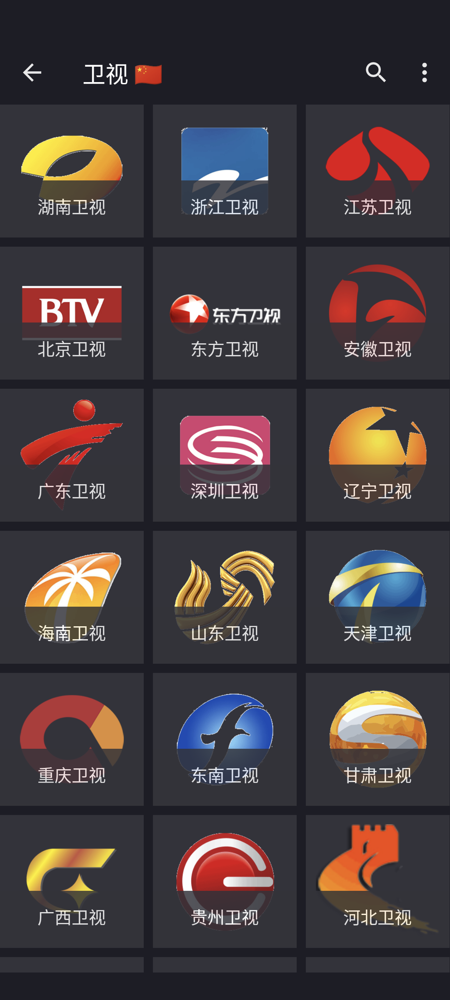

  

  
  
  
  
  

---
本项目收集了各种节目源，这些源来自互联网，非独创。如果发现有任何纠纷，请及时联系原作者解决。我们强调共享乐趣胜过独自享受，希望能够为大家带来更多的欢乐和娱乐。

This project compiles various sources of programs, which are sourced from the internet and not original creations. If any disputes are found, please promptly contact the original authors for resolution. We emphasize the importance of sharing joy over enjoying alone, hoping to bring more happiness and entertainment to everyone.

免责声明：本项目仅用于分享娱乐信息，不对节目内容的合法性和准确性负责。

Disclaimer: This project is intended solely for sharing entertainment information and does not take responsibility for the legality or accuracy of the program content.

## IPTV

  
  
  

